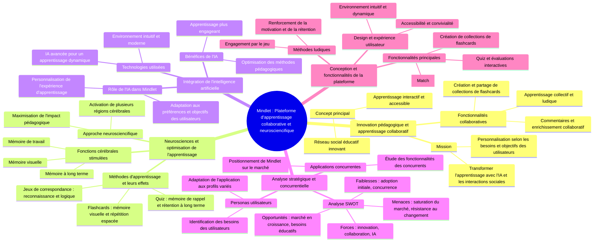

# 2.5 Analyse SWOT (Forces, Faiblesses, Opportunités, Menaces)

L'analyse SWOT est essentielle pour établir une stratégie marketing claire et efficace en identifiant les atouts de Mindlet, tout en prenant en compte ses vulnérabilités et les possibilités de croissance.

## Forces

- Innovation technologique : La combinaison de l'IA, de l'apprentissage collaboratif et de la gamification distingue Mindlet des autres applications d'apprentissage. L'IA permet de personnaliser l'apprentissage en générant automatiquement des flashcards adaptées aux besoins de chaque utilisateur.
- Multiplateforme : L'application est disponible sur une variété de plateformes (iOS, Android, Web, Windows, MacOS, Linux), permettant une large accessibilité.
- Approche collaborative : Mindlet favorise l'apprentissage communautaire avec des défis, des partages de cartes, des groupes d'études, et une interaction constante entre utilisateurs.
- Gamification et motivation : L'intégration de jeux (Match, quiz) stimule l'engagement des utilisateurs, rendant l'apprentissage non seulement plus intéressant mais aussi plus efficace.

## Faiblesses

- Notoriété faible à ce jour : En tant que nouvelle application, Mindlet doit développer sa marque et gagner la confiance des utilisateurs.
- Courbe d'apprentissage pour les utilisateurs non familiers avec la technologie : Certaines fonctionnalités peuvent être perçues comme complexes au début, en particulier pour les personnes moins technophiles.
- Dépendance au contenu utilisateur : Le succès de l'application dépend en grande partie de la capacité des utilisateurs à créer, partager et enrichir des contenus de manière régulière.

## Opportunités

- Croissance du marché de l'éducation en ligne : Avec la montée des plateformes d'apprentissage en ligne, Mindlet est bien positionné pour capter l'intérêt des étudiants, des professionnels en reconversion et des formateurs.
- Développement de partenariats avec des institutions : En s'associant avec des universités, écoles, entreprises et organisations d'apprentissage, Mindlet peut élargir son champ d'application et accroître sa crédibilité.
- Expansion dans des niches spécifiques : Mindlet peut se diversifier en proposant des fonctionnalités ciblées pour des groupes particuliers comme les formateurs, les coachs, les chercheurs ou les créateurs de contenu éducatif.

# Carte Mentale - Cahier des charges et analyse de l'application Mindlet : une plateforme d'apprentissage collaborative et neurosciencifique

